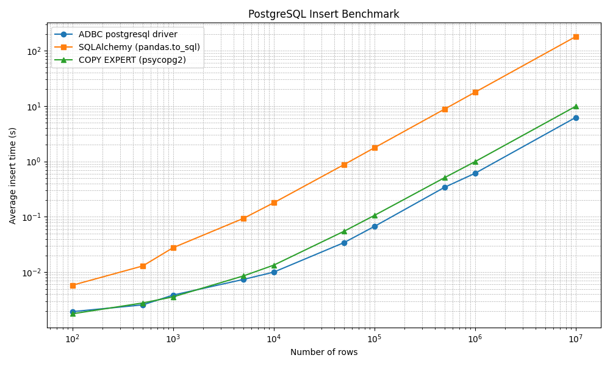

## ADBC vs SQLAlchemy vs Copy Expert

https://arrow.apache.org/adbc/current/driver/postgresql.html

5 samples for each benchmark.

Hardware:

- Kernel: Linux 6.12.39-1-MANJARO
- CPU: AMD Ryzen 7 7700X (16) @ 5.57 GHz
- System memory: 32 GB DDR5 Kingston, 5200 MT/s
- Storage:

```
sudo hdparm -Tt /dev/nvme0n1

/dev/nvme0n1:
 Timing cached reads:    60908 MB in  1.98 seconds = 30712.88 MB/sec
 Timing buffered disk reads: 15764 MB in  3.00 seconds = 5254.03 MB/sec
```

| Rows | ADBC (s) | SQLAlchemy (s) | COPY EXPERT (s) |
|---|---|---|---|
| 100 | 0.0019 | 0.0058 | 0.0018 |
| 500 | 0.0026 | 0.0130 | 0.0028 |
| 1,000 | 0.0039 | 0.0277 | 0.0036 |
| 5,000 | 0.0074 | 0.0937 | 0.0086 |
| 10,000 | 0.0101 | 0.1794 | 0.0134 |
| 50,000 | 0.0343 | 0.8771 | 0.0550 |
| 100,000 | 0.0671 | 1.7624 | 0.1061 |
| 500,000 | 0.3423 | 8.8265 | 0.5110 |
| 1,000,000 | 0.6104 | 17.7425 | 0.9913 |
| 10,000,000 | 6.2162 | 178.7214 | 9.8655 |




## i love apache arrow :)

writing arrow table efficiently to postgres using copy expert:

```python
import pyarrow as pa
import pyarrow.csv as pc
import psycopg2
from io import BytesIO

# Create Arrow table
arrow_table = pa.table({
    "id": [1, 2, 3],
    "name": ["Alice", "Bob", "Charlie"]
})

# Write Arrow table to CSV in memory (as bytes)
sink = pa.BufferOutputStream()
pc.write_csv(arrow_table, sink)
csv_buffer = BytesIO(sink.getvalue().to_pybytes())  # No decoding, no copy of str, BUT copy of bytes (.to_pybytes)

# Connect to PostgreSQL
conn = psycopg2.connect("dbname=your_db user=your_user password=your_pass")
cur = conn.cursor()

# COPY expects text, so decode on-the-fly using TextIOWrapper
from io import TextIOWrapper
text_stream = TextIOWrapper(csv_buffer, encoding="utf-8")

# Execute COPY FROM STDIN
copy_sql = "COPY your_table (id, name) FROM STDIN WITH CSV HEADER"
cur.copy_expert(copy_sql, text_stream)

conn.commit()
cur.close()
conn.close()

```

## LINKS

good article on polars + duckdb writing to postgres
https://aklaver.org/wordpress/2024/03/08/using-polars-duckdb-with-postgres/
