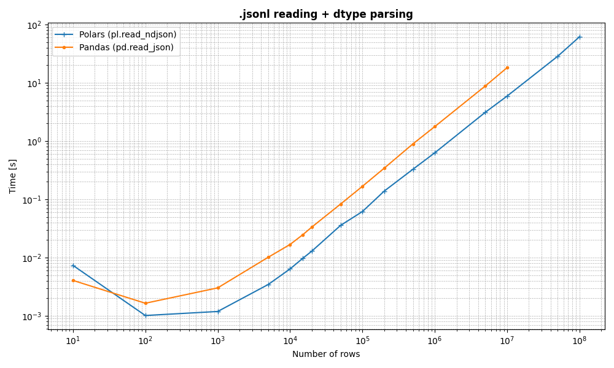

## reading .jsonl files in Python fast

Hardware:

- Kernel: Linux 6.12.39-1-MANJARO
- CPU: AMD Ryzen 7 7700X (16) @ 5.57 GHz
- System memory: 32 GB DDR5 Kingston, 5200 MT/s
- Storage:

```
sudo hdparm -Tt /dev/nvme0n1

/dev/nvme0n1:
 Timing cached reads:    60908 MB in  1.98 seconds = 30712.88 MB/sec
 Timing buffered disk reads: 15764 MB in  3.00 seconds = 5254.03 MB/sec
```

polars ftw, no memory footprint basically, and better schema spec support

pandas OOM any file larger than ~3GB (i have 32GB system memory) IT EVEN FILLED THE SWAP and crashed my pc :(

| **Rows** | **Polars** | **Pandas** |
|---|---|---|
| 10 | 0.007355659000495507 | 0.004064355999616964 |
| 100 0.0010151719998248154 | 0.0016479510004501208 |
| 1000 0.0011897929998667678 | 0.0030234559999371413 |
| 5000 0.003459230999396823 | 0.010151022000172816 |
| 10000 0.006393096000465448 | 0.01679692800007615 |
| 15000 0.009729254000376386 | 0.024701235000065935 |
| 20000 0.012915016999613727 | 0.03341553700010991 |
| 50000 0.03575382399958471 | 0.083116173000235 |
| 100000 0.06168411700036813 | 0.16723211800035642 |
| 200000 0.13832516799993755 | 0.34223719199962943 |
| 500000 0.3287481580000531 | 0.8960139920000074 |
| 1000000 0.6282745099997555 | 1.7710612209993997 |
| 5000000 3.120174565000525 | 8.824555703999977 |
| 10000000 5.9219563780006865 | 18.19564802900004 |
| 50000000 28.512838358999943 | N/A (OOM) |
| 100000000 61.52426286500031 | N/A (OOM) |



